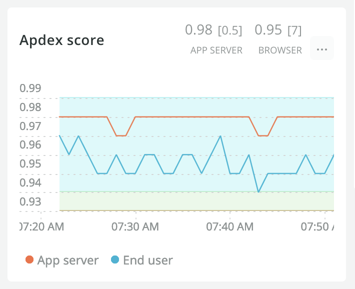
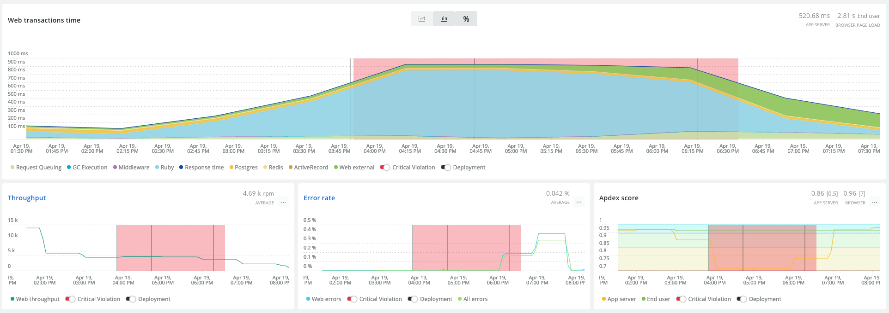
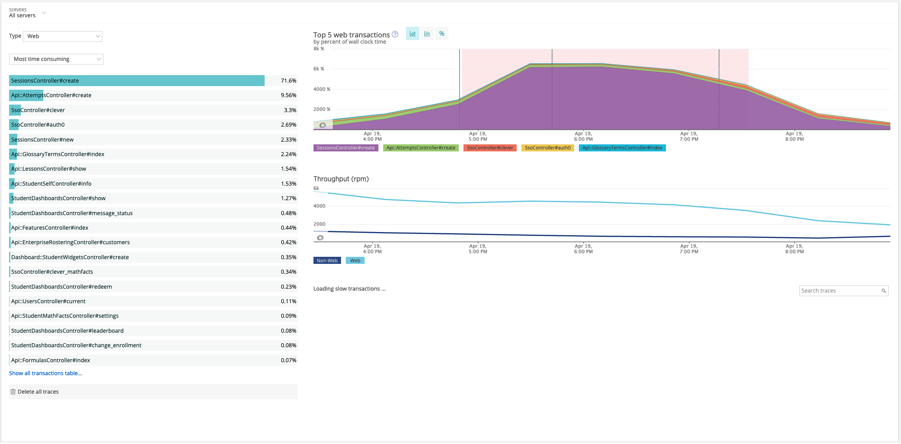
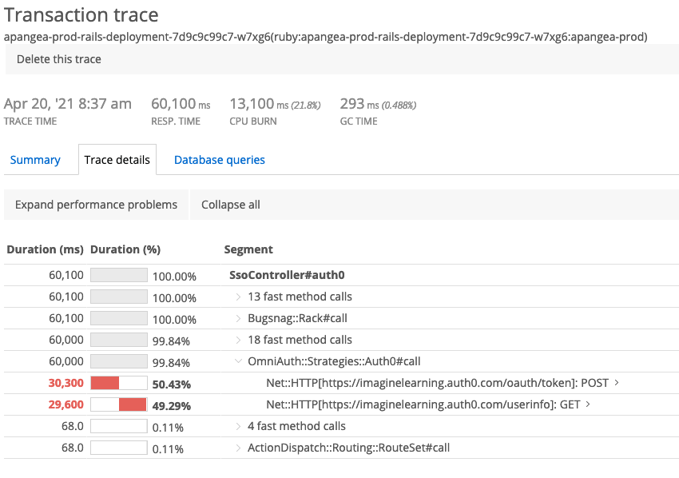
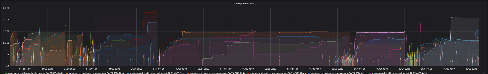
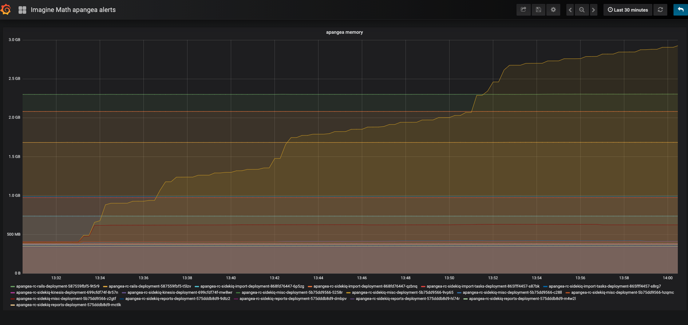
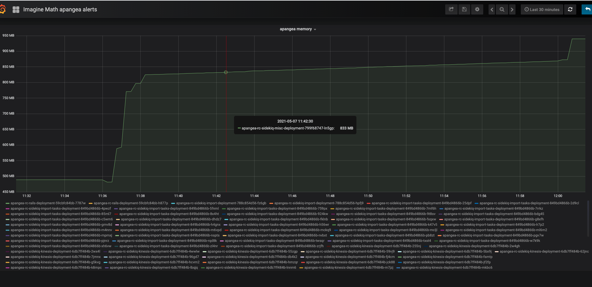

# Overview of Prometheus

Prometheus is an open-source systems monitoring and alerting toolkit, originally
built at SoundCloud. It is now a standalone solution and is part of the Cloud
Native Computing Foundation. It collects metrics about your applications and
infrastructure using an HTTP pull model. Grafana can be used to query the
Prometheus data to show in graphs on a dashboard. Alerts can also be configured
to send notifications when specified thresholds are reached.

## Case Studies

### Brute Force Attack

A month or so ago, we got alerted by New Relic that our Apdex score had dropped
below it's configured threshold. New Relic tracks two Apdex scores, one for the
App Server health and the other for End User experience. In this case, the App
Server apdex was triggering the alert.

We were a bit confused, at first, as this was occurring towards the end of the
day while the overall throughput was decreasing. The only issue we could see was
a somewhat sudden increase in our response times:

But after drilling in to the transactions we found it was our sign in endpoint
(`SessionsController#create`) in particular that was suddenly taking 2-3 seconds
longer than usual:

Eventually we drilled into a specific transaction trace that New Relic tracks.
We didn't take a screenshot of it, but it looks something like this:

Imagine Math's sign in endpoint is a little odd. It hits the Imagine Learning
Auth Service to obtain a JWT for the user and sets it in a cookie before
creating a Rails session to sign the user into Imagine Math. The trace we saw
reminded us that we had added some retry logic in around the call made to the
Auth Service, hoping to catch any transient errors.

So the Auth Service was returning error responses and then Imagine Math would
wait .5 seconds, retry, then wait 1 second and retry and finally 1.5 seconds and
retry for a total of 2 seconds. So that solved the initial mystery as to why we
had a sudden uptick in our request time by 2 seconds. But we needed to
investigate why the Auth Service was erroring out now.

We inspected the Auth Service's Grafana dashboard and verified that there was an
uptick in error responses. However, the response codes were 400's, which
indicates an issue with the input (username and password) not the service
itself. After inspecting the Auth Services logs, sure enough, we found the these
requests were invalid user/password request. Apparently, someone was trying to
brute force an account.

The odd thing was the username being used in this attack didn't actually exist
in Imagine Math. So we're not exactly sure what they were trying to accomplish.
The attack eventually stopped and we added action items to prevent such attacks
in the future. We also updated our retry logic to be a bit more robust such as
not retrying invalid username/password attempts.

We were glad that we had tools like New Relic and Prometheus to debug this issue
or we would have completely been in the dark.

### Memory Leak

Imagine Math's core is built in Ruby on Rails. We use a library called Sidekiq
to process asynchronous background jobs. Sidekiq runs a number of workers that
will process jobs as they are queued. These workers are deployed and managed
through Kubernetes.

We have a particular job that will export all the students, classrooms,
educators, and organizations in a given district as part of a backup for the
ongoing rostering process. The process has been pretty stable for some time;
however, it spontaneously started to fail. We had been receiving reports of
exports getting stuck and never completing. However, there was nothing in our
logs (Bugsnag and Kibana) that indicated any errors were occurring.

Our team has learned from experience that when Sidekiq jobs are failing without
errors, it's usually because the pod is being killed due to memory or CPU limits
being reached. So we checked Grafana to see if we could tell if we were running
into this scenario. Sure enough, we discovered that the
`apangea-prod-sidekiq-misc-deployment`, where the export job runs, was going
above its limit of 3GB of memory and subsequently being killed. You can see some
examples of this below:

We were a little confused since the code around this hasn't changed for some
time. We had recently upgraded from Rails 4 to 5, but we didn't think that would
have a bearing on this issue. Until we discovered that it did. Sidekiq's
[wiki](https://github.com/mperham/sidekiq/wiki/Problems-and-Troubleshooting#activerecord-query-cache)
pointed us in the right direction:

> Even when performing batched reads correctly... the ActiveRecord query cache
> can cause memory bloat by storing query resultsets unnecessarily. Since Rails
> 5.0, the query cache is enabled by default for background jobs, including
> Sidekiq workers. If your job performs a large number of batched reads and is
> still using lots of memory, try disabling the query cache or clear query cache
> manually.

:facepalm: Oh man... so the query cache wasn't used in Sidekiq in Rails 4, but
it was enabled by default in Rails 5. Ruby on Rails has this query cache that
will cache the results of each query made. This is great in the context of a
controller action where the cache only stays alive for the duration of the
request. You can make the same query over and over without having to hit the
database each time. But for a background process that is long living, this
introduces a pretty big memory leak if you're constantly making large queries
like we were in our exports job.

So the fix for this issue was to disable the query cache for our Sidekiq jobs.
Because we're already tracking memory in Grafana, we could verify this fix by
running exports and monitoring the memory usage. Here's an example of an export
before we made this change (the yellow line):

Here's one after:

It went from using over 3GB, over a 30 minutes timespan, to just below 1GB.
Thanks to Prometheus and Grafana we were able to have better insight into the
cause of the issue and discover a solution pretty quickly.
